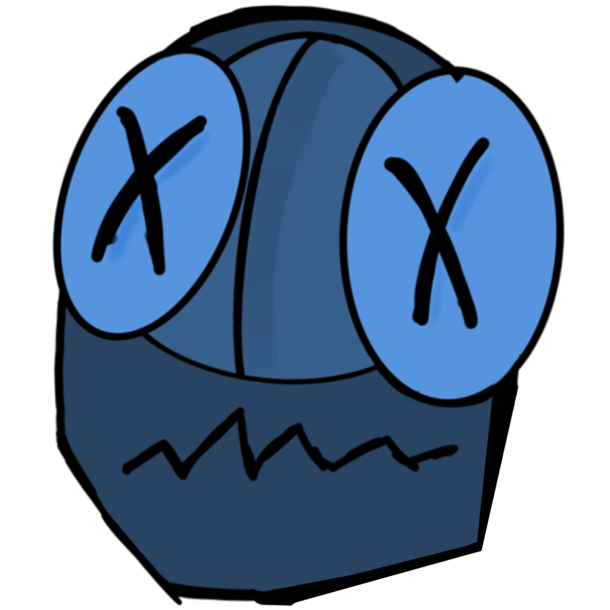

<div align="center">
  
  <h1>Imprffctgames</h1>
  <p><strong>Sistema de Juegos Solitarios competitivos</strong></p>
  <p><em>TFG - Grado en Ingeniería Informática</em></p>
  
  
  
  
      
</div>

Este proyecto es un sistema de juegos solitarios de código abierto diseñado para competir por aparecer lo mejor en el ranking de global.

Se trata de una aplicación web que permite a los jugadores seleccionar entre varios juegos de código abierto y jugar de manera rápida y divertida. Además, se incluye una función de ranking que permite a los usuarios ver sus mejores puntuaciones y comparar con otros jugadores.

Se ha integrado un sistema de autenticación y seguridad para proteger la información personal y la progresión en el juego. Además, se ha implementado mecanismos de control de acceso para evitar ataques de fuerza bruta y manejo de trampas.

[](https://imprffctgames.com/)

## Juegos disponibles

- Who's that Pokémon: se trata de adivinar nombres de Pokémon en 60s.
  Puedes estudiar los distintos nombres aquí: https://www.pokemon.com/es/pokedex
- 15 Puzzle: se trata de ordenar 15 bloques en una cuadrícula de 4x4.

## Manual de instalación

El proyecto está diseñado para funcionar con Docker y Docker Compose. Pero también se puede ejecutar localmente desde el directorio raíz del proyecto si tienes instalado pnpm, Node.js y MongoDB. En ese caso, puedes levantar el proyecto con `pnpm --filter '**' dev` después de clonar el repositorio y configurar las variables de entorno.

Sin embargo, me centraré en la instalación con Docker y Docker Compose.

### Configuración inicial

El primer paso es clonar el repositorio, con el comando `git clone git@github.com:antaga04/puzlynk.git` por ejemplo.

Después, el proyecto incluye un archivo `.env.dist`. Debes copiarlo y renombrarlo como `.env`:

```bash
cp .env.dist .env
```

- Las variables ya incluyen valores por defecto para el funcionamiento básico.
- Algunas funcionalidades requieren configurar servicios externos:

| Servicio     | Función                                         | Registro         |
| ------------ | ----------------------------------------------- | ---------------- |
| Cloudinary   | Gestión de imágenes de avatar                   | cloudinary.com   |
| Resend       | Envío de correos (confirmación, recuperación)   | resend.com       |
| Mailboxlayer | Validación de direcciones de correo electrónico | mailboxlayer.com |

Si no se configuran, la app funcionará, pero esas características estarán deshabilitadas o generarán error.

### Requisitos previos

- **Docker** y **Docker Compose** instalados ([Descargar Docker](https://www.docker.com/get-started/)).
- Al menos **4 GB de RAM** y procesador con soporte de virtualización.
- Puertos disponibles:
    - **8000** → backend
    - **5173** → frontend
    - **27017** → MongoDB (si ya tienes MongoDB instalado localmente, ajusta el puerto o elimina el servicio en `compose.yaml`).

### Ejecución

Todas las operaciones se gestionan mediante un Makefile que simplifica los comandos de Docker.

| Comando        | Descripción                                                |
| -------------- | ---------------------------------------------------------- |
| make build     | Construye contenedores y arranca la aplicación.            |
| make start     | Inicia contenedores ya construidos.                        |
| make stop      | Detiene los contenedores.                                  |
| make down      | Elimina contenedores sin borrar volúmenes.                 |
| make down-v    | Elimina contenedores y volúmenes.                          |
| make logs      | Muestra los logs en tiempo real.                           |
| make clean     | Limpieza total (contenedores, volúmenes, imágenes).        |
| make bootstrap | Construye y ejecuta la seed inicial de la base de datos.   |
| make initdb    | Inicializa la base de datos con datos por defecto.         |
| make seed      | Abre menú interactivo para poblar colecciones manualmente. |

Para empezar:

```bash
make bootstrap
```

### Seed de base de datos

- Automática (initdb): genera todas las colecciones iniciales (Games, Pokemons, Users, Scores).
- Manual (seed): menú interactivo para elegir qué colecciones poblar, útil en desarrollo.

### Contribuciones

Este proyecto acepta contribuciones mediante el flujo estándar de fork + pull request:

1. Haz un fork del repositorio.
2. Crea una rama nueva:
    ```bash
    git  switch -c feature/nueva-feature
    ```
3. Realiza tus cambios y súbelos a tu fork.
4. Abre un pull request al repositorio principal explicando las modificaciones.

## Contacto

[](https://www.linkedin.com/in/adrian-anta-gil/)
[](mailto:antaga04@gmail.com)
